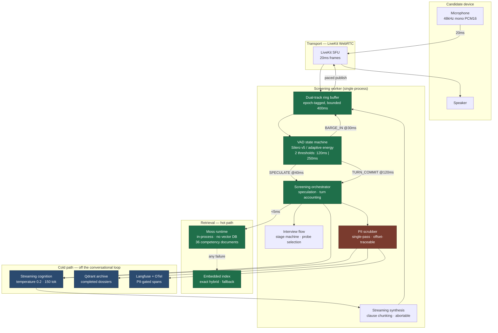
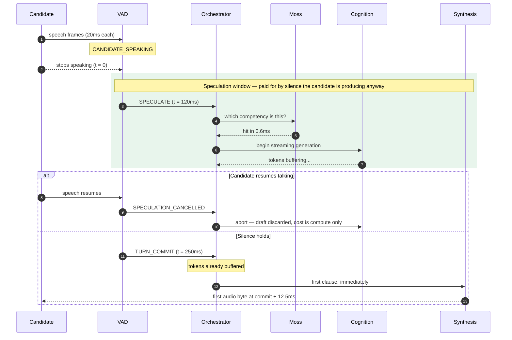
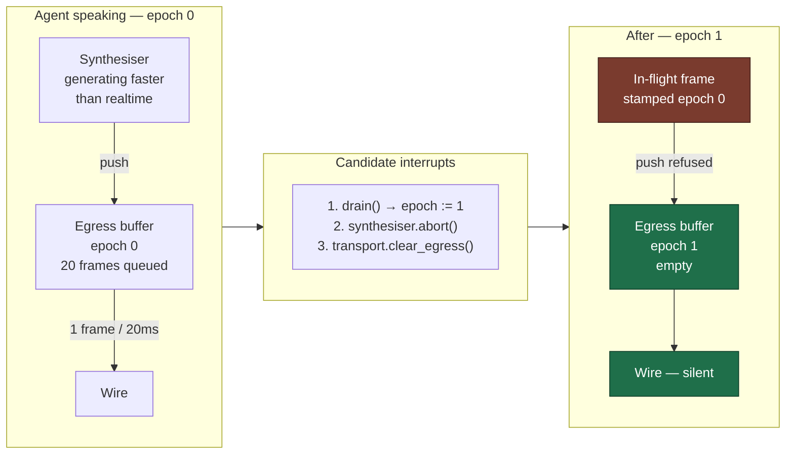
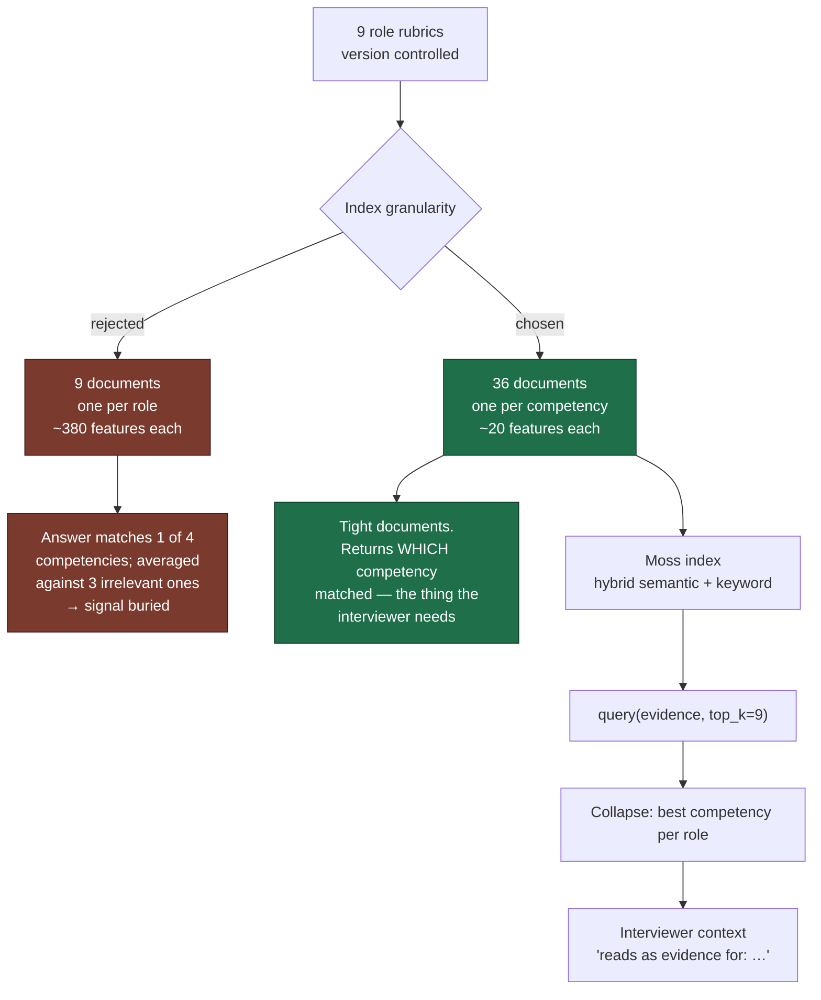
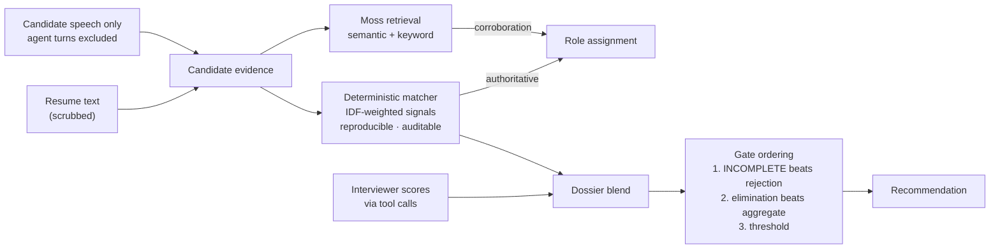
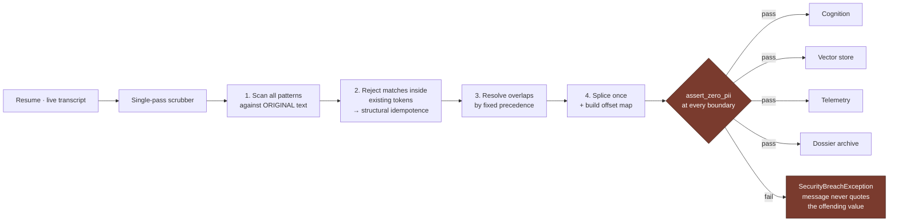
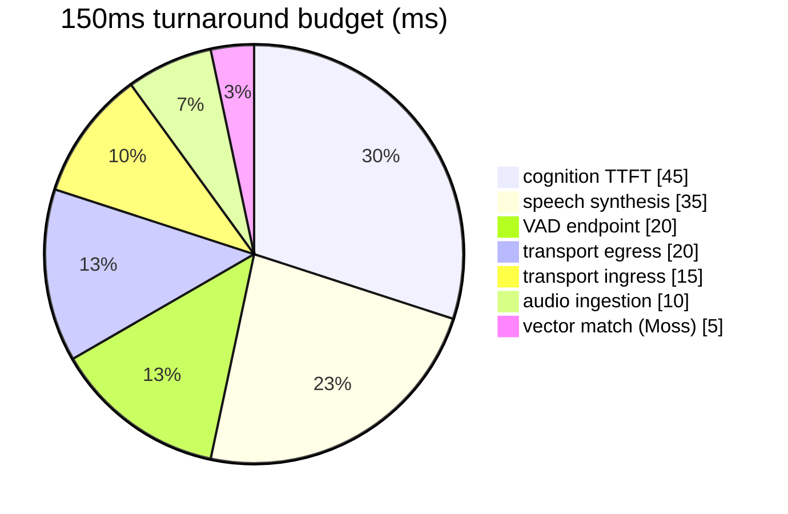
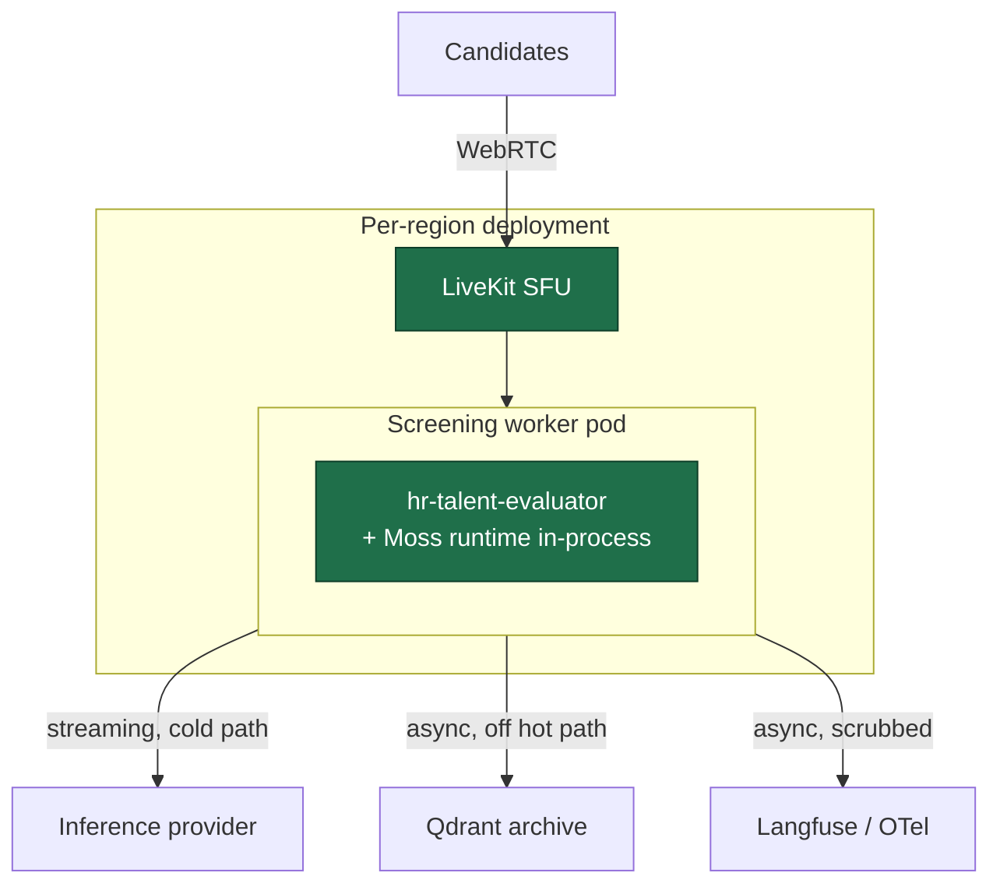

# Architecture

`hr-talent-evaluator` — sub-150ms voice screening agent, Moss on the retrieval hot path.

---

## 1. System overview

**Green** is the conversational hot path, governed by the 150ms budget.
**Blue** is everything that must never block a turn.
**Red** is the security boundary every outbound payload crosses.

---

## 2. The speculation timeline

This is the mechanism that makes the budget reachable.

Without speculation the same turn costs **43ms** after commit: retrieval, then
time-to-first-token, then synthesis, all serialised behind the candidate's wait.
With it, **12.5ms** — a 71% reduction, asserted directly by
`test_speculation_is_what_buys_the_budget`.

---

## 3. Barge-in: epoch invalidation

The failure a naive implementation ships: cancel the producer, but the queue
between synthesiser and wire keeps draining, so the agent talks over the
candidate for another few hundred milliseconds.

Order is load-bearing. The epoch is bumped **first**, retroactively invalidating
every frame already in flight; only then is the producer cancelled. Cancelling
first leaves a window where the synthesiser's final frame lands in a
freshly-cleared buffer and gets published after the interrupt.

Measured: **0.036ms** to drop 400ms of queued audio, zero frames published
afterwards, agent recovers the floor for the next turn.

---

## 4. Retrieval corpus layout

Over-fetching (`top_k = 3 × limit`) then collapsing per role is deliberate:
several competencies of the *same* role routinely match one answer, and the
caller wants distinct roles back, not three slices of one.

---

## 5. Two independent scoring channels

Role assignment affects a person's career, so it is never a single model call.

Agent speech is excluded from the evidence on purpose: it contains the rubric's
own vocabulary, so scoring against it would let the interviewer's questions
inflate the candidate's score — the classic self-confirming evaluation bug.

Where a competency was probed live, the interviewer's score wins: a demonstrated
explanation is stronger evidence than a mention on a resume. The matcher fills
the gaps so an unreached competency still carries its resume signal rather than
scoring zero.

---

## 6. Security boundary

The gate **re-scans** rather than trusting a flag, because the failure that
actually happens in production is text being concatenated back together after
scrubbing.

---

## 7. Latency budget allocation

`assert_budget_is_coherent()` runs at import and refuses to start the process if
these stop summing to 150 — the budget table is the one place an engineer is
tempted to "just add 5ms" under deadline.

---

## 8. Deployment topology

Moss ships **inside the worker pod**. There is no retrieval tier to scale, no
network hop to budget for, and no vector database to operate — which is the
entire reason the 5ms line item is real. Workers are stateless between
sessions and scale horizontally per concurrent interview.